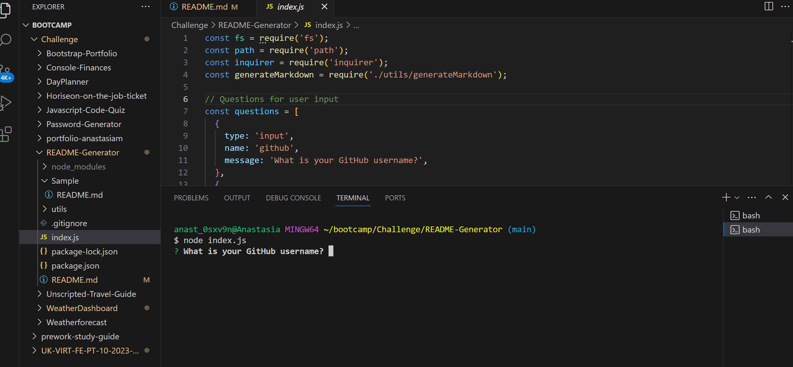

# README Generator

I have been tasked with creating a command-line application that dynamically generates a professional README.md file from a user's input. The application will be invoked by using the following command:

```bash
node index.js
```

## Installation

- To open the repository and access cloning please follow this link: https://github.com/anamorai/README-Generator

- To see the video walk-through please follow this link: https://drive.google.com/file/d/1PN0kZGZz060VxeBdkfn6dG_eBuIo63mV/view

## Usage 

Once you clone the repository and open it in your terminal and type in node index.js it will begin the series of prompts. It look as follows:




## Badges


## Features

* A command-line application that accepts user input.
* A README.md is generated with:
  * The title of my project 
  * Sections entitled:
  * Description 
  * Table of Contents 
  * Installation 
  * Usage 
  * License 
  * Contributing 
  * Tests 
  * Questions
* A list of options provided for license and then a badge for that license is added near the top of the README.
* When a user enters their GitHub username then this is added to the section of the README entitled Questions, with a link to their GitHub profile
* When a user enters their email address then this is added to the section of the README entitled Questions, with instructions on how to reach them with additional questions
* When a user clicks on the links in the Table of Contents, they are taken to the corresponding section of the README

## Credits

I would like to reference my tutor Samuel Cordova for guiding me with this task as well as my course instructore Pratikto Ariestyadi for teaching me everything I would need to know to complete it.

## License

MIT License

Copyright (c) [2024] [Anastasia Moraites]

Permission is hereby granted, free of charge, to any person obtaining a copy
of this software and associated documentation files (the "Software"), to deal
in the Software without restriction, including without limitation the rights
to use, copy, modify, merge, publish, distribute, sublicense, and/or sell
copies of the Software, and to permit persons to whom the Software is
furnished to do so, subject to the following conditions:

The above copyright notice and this permission notice shall be included in all
copies or substantial portions of the Software.

THE SOFTWARE IS PROVIDED "AS IS", WITHOUT WARRANTY OF ANY KIND, EXPRESS OR
IMPLIED, INCLUDING BUT NOT LIMITED TO THE WARRANTIES OF MERCHANTABILITY,
FITNESS FOR A PARTICULAR PURPOSE AND NONINFRINGEMENT. IN NO EVENT SHALL THE
AUTHORS OR COPYRIGHT HOLDERS BE LIABLE FOR ANY CLAIM, DAMAGES OR OTHER
LIABILITY, WHETHER IN AN ACTION OF CONTRACT, TORT OR OTHERWISE, ARISING FROM,
OUT OF OR IN CONNECTION WITH THE SOFTWARE OR THE USE OR OTHER DEALINGS IN THE
SOFTWARE.
